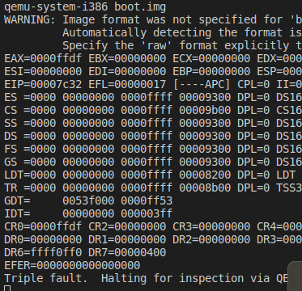

# Create my own OS from scratch

## Bootloader

#### milestones

1. BIOS loads the boot.img to 0x7c00
2. set segment, enable A20
3. GDT, protected mode, set segment
4. GDB debugging
5. ELF structure
6. load kernel

#### pits
1. > Problem:
   
    When dismissed **code16** directive in the **start** entry point, executing boot program will report **triple** **fault** error like the following.
    
   

   > Reasoning：
    
    weak reason: assembler using code16 to assemble the code as default, when translate protected mode, protected mode doesnot support code16 instruction.

   > Solution：

     Insert **.code16** directive in the **start** entry point.

2 . > Problem:

    When dismissed symbol file, **gdb** will not work

    > Reasoning:
    
    really week, gdb needs symbol file to help debug

    > solution:
     
     add **symbol** file, which is the **ld** output file

3. > Problem:
    
    When loading kernel img from disk, I want to know if interrupts are disabled, how to control/read disk. there are so many reference in the website.
    However, all of them are interfaces, without specific reference.
  
   > solution:

   OS3EP, gives brief summary of disk process, and interface, and specific reference. memory mapped io


4. > Problem:
   
   When compile **JOS** with make, the **ld** reports warning on bss and undefined reference like the following.

```
+ as kern/entry.S
+ cc kern/entrypgdir.c
+ cc kern/init.c
+ cc kern/console.c
+ cc kern/monitor.c
+ cc kern/printf.c
+ cc kern/kdebug.c
+ cc lib/printfmt.c
+ cc lib/readline.c
+ cc lib/string.c
+ ld obj/kern/kernel
ld: warning: section `.bss' type changed to PROGBITS
obj/kern/printfmt.o: In function `printnum':
lib/printfmt.c:41: undefined reference to `__udivdi3'
lib/printfmt.c:49: undefined reference to `__umoddi3'
kern/Makefrag:70: recipe for target 'obj/kern/kernel' failed
make: *** [obj/kern/kernel] Error 1

```

> solution:

sudo apt intall gcc-multilib

## TIPS:

  **what does os, gdb or other system doing in startup?**
  
  **you should always think where your data structure in memory. Because in kernel, your data will get invalid if you not consider, which is different to user program.**


## memory management:

#### milestones

1. code refactor of build system,makefile,etc.
2. memory detect, key data structure.
3. physical memory management
4. vitual memory management
5. kernel region map

#### pits

1. >problem:

  when 'ld' loads boot program(boot.o,bootmain.o), the right case is that the entry point of boot.o linked to 0x7c00. However, if the order reverse, the bootmain.o will be linked to 0x7c00.


**The right case**:

```
Disassembly of section .text:

00007c00 <start>:
.global start

## boot program entry
start:
    .code16
    cli     ## diable interrupts, because BIOS interrupts won't make sense,but may behave incorrectly
    7c00:	fa                   	cli    
    cld     ## increment string operation from low address to high address, while ctd is reverse.
    7c01:	fc                   	cld    
    
    # set segments registers to 0
    xorw %ax,%ax
    7c02:	31 c0                	xor    %eax,%eax
    movw %ax, %ds # data segment
    7c04:	8e d8                	mov    %eax,%ds
    movw %ax, %ss # stack segment
    7c06:	8e d0                	mov    %eax,%ss
    movw %ax, %es # extra segment
    7c08:	8e c0                	mov    %eax,%es
``` 

**wrong case**:

```
Disassembly of section .text:

00007c00 <waitdisk>:

static inline uint8_t
inb(int port)
{
	uint8_t data;
	asm volatile("inb %w1,%0" : "=a" (data) : "d" (port));
    7c00:	ba f7 01 00 00       	mov    $0x1f7,%edx
    7c05:	ec                   	in     (%dx),%al
```

>solution:

```
ld -m    elf_i386   -Ttext 0x7C00  -e entry obj/boot/boot.o obj/boot/bootmain.o -o obj/boot/boot.out

```


## user environment:
